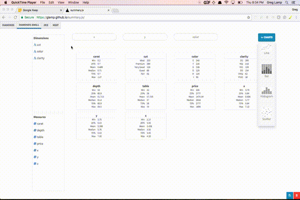

# summary.js



```
npm install
npm start
```


### Notes
On my Macbook Air with 4GB of RAM I can use datasets with about 1M rows. That 
might not seem like that much, but you shouldn't ever need to plot 1M individual
data points--it would just look like Barry Bonds smashed a funfetti piñata.
